# Arcadedu

An AI learning universe with an autonomous study agent on top of it.

<p align="center">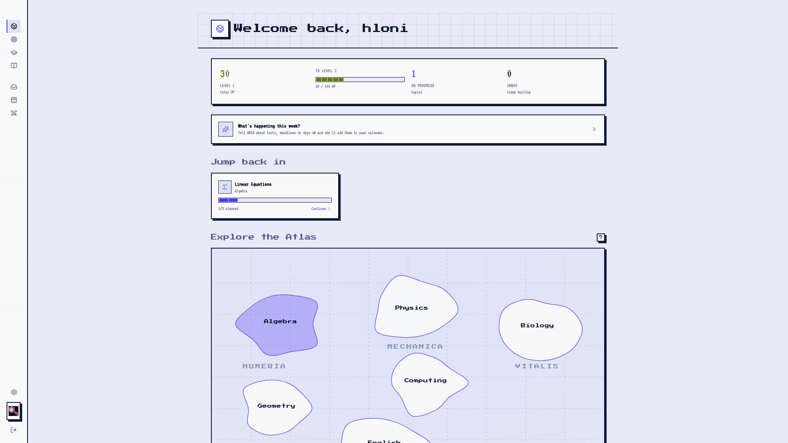</p>

Two principles hold the whole system together:

> **The AI teaches. It never does the student's work.**
> The student never gets a free prompt box. Every model call is a fixed `action`
> from a closed set, and a server-side registry decides what the model may do for
> that action.

> **The agent manages the learning. The student does the learning.**
> Given a goal and a deadline, the study agent keeps the plan feasible as the
> student's week drifts, and stays quiet unless a human decision is genuinely
> required. It can plan, assess, schedule, and adapt. It cannot solve the
> student's actual assignment, invent XP, or write a mastery score.

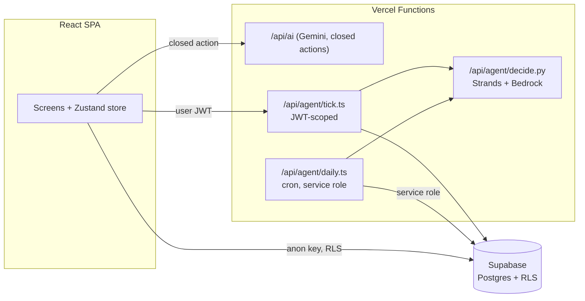

| Layer | What it is | Where |
| --- | --- | --- |
| **The learning game** | Atlas of subjects → topics → Candy-Crush node paths of AI-generated challenges, a Story mode, a closed-action Study Hall, a deterministic progression engine. | `src/game/`, `src/screens/`, `api/ai.ts` |
| **The Autonomous Study Agent** | Study Missions with a diagnostic, a deterministic mastery + plan-confidence engine, an academic calendar + recurring routines, a Strands agent that proposes plan changes, and a deterministic gate that validates and applies them. Everything routine surfaces in one Inbox. | `src/study/`, `api/agent/`, migrations `0002` through `0007` |

---

## Table of contents

- [Part I: The learning game](#part-i-the-learning-game)
- [Part II: The Autonomous Study Agent](#part-ii-the-autonomous-study-agent)
- [The agent does the work, not you](#the-agent-does-the-work-not-you)
- [How AI is used, end to end](#how-ai-is-used-end-to-end)
- [How Supabase is used, end to end](#how-supabase-is-used-end-to-end)
- [Repository layout](#repository-layout)
- [Setup](#setup)
- [Environment variables](#environment-variables)
- [Testing](#testing)
- [Look & feel](#look--feel)
- [Status and roadmap](#status-and-roadmap)

---

# Part I: The learning game

## Screens and how they connect

Navigation is an expand-on-hover sidebar ([AppShell.tsx](src/components/AppShell.tsx)):
**Atlas · Inbox · Calendar · Missions · Learn · Story · Quests · Profile**. The
Inbox badge is live, showing unread agent decisions plus anything overdue or
due today.

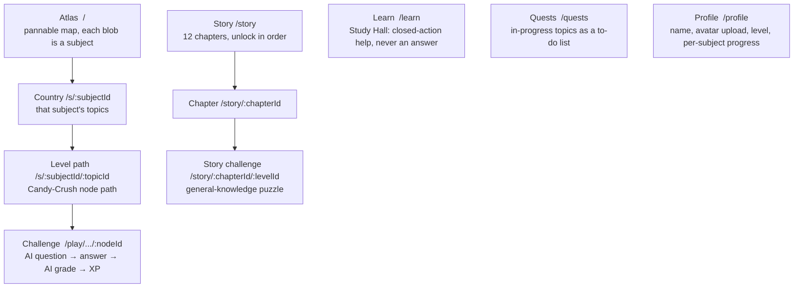

**The Atlas content model** ([atlas.ts](src/game/atlas.ts)) is one file,
`SUBJECTS: Subject[]`. There is no authored question bank. Because the AI
generates and grades every challenge from the `(subject, topic)` strings, a
node only carries a `title` and a difficulty `tier`
(`trivial → easy → medium → hard`, the last node of a topic is `boss`). Six
subjects across four continents: **Numeria** (Algebra, Geometry), **Mechanica**
(Physics, Computing), **Vitalis** (Biology), **Lexica** (English). To add a
subject or topic, just add an entry here; nothing else needs touching.

**Progression** is gated at exactly one layer: nodes inside a topic run in
sequence (`selectNodeUnlocked` in [store.ts](src/store.ts)). Worlds and topics
are **never** locked, on purpose. A learner who wants inequalities before
linear equations goes straight there. Story chapters unlock in order; levels
within a chapter are sequential.

<table><tr>
<td width="240">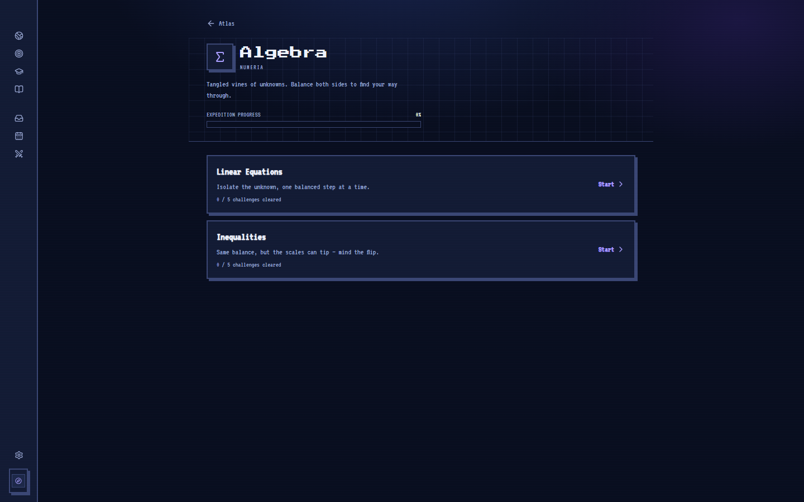<br><sub>Country: a subject's topics</sub></td>
<td width="240">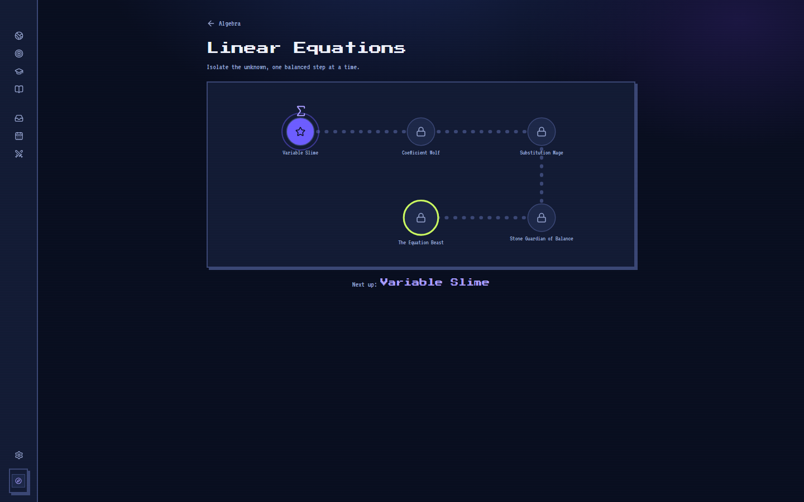<br><sub>Level path: the node path through a topic</sub></td>
<td width="240">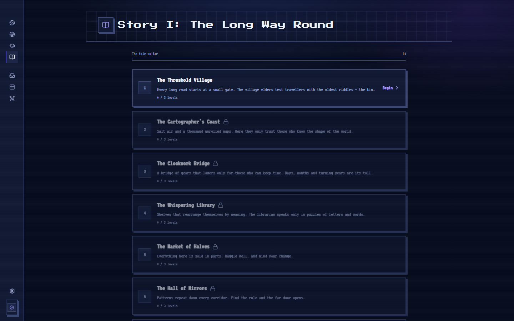<br><sub>Story: 12 chapters, unlock in order</sub></td>
</tr><tr>
<td width="240">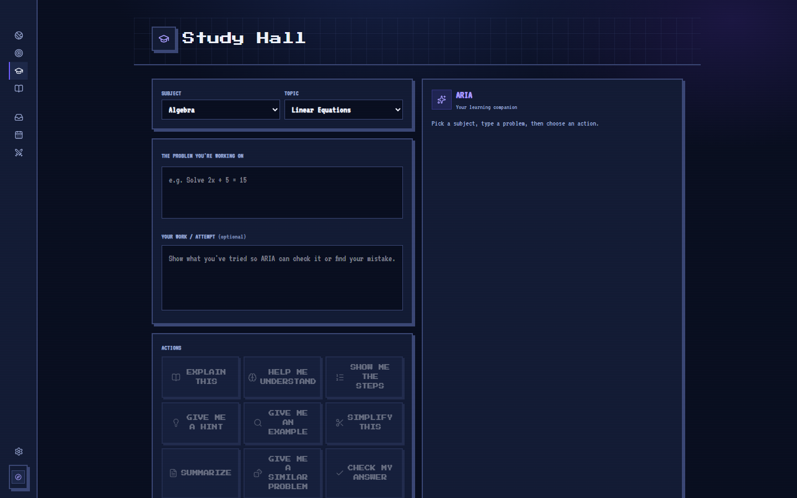<br><sub>Study Hall: closed-action help</sub></td>
<td width="240">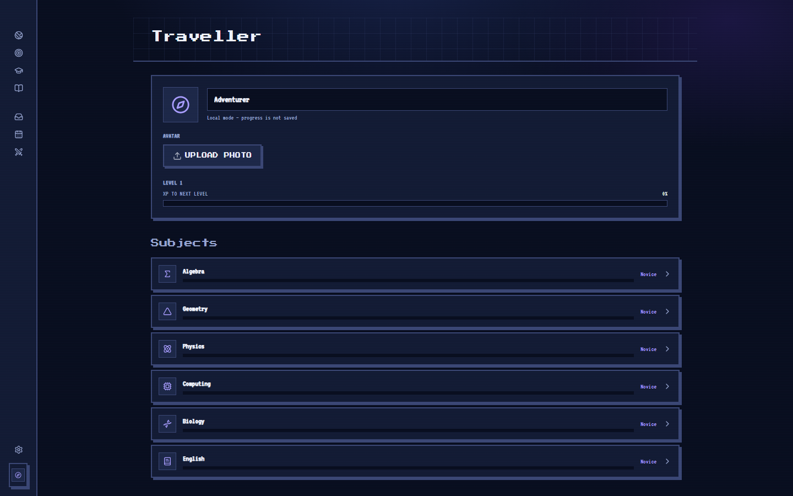<br><sub>Profile: subjects, level, photo upload</sub></td>
<td width="240">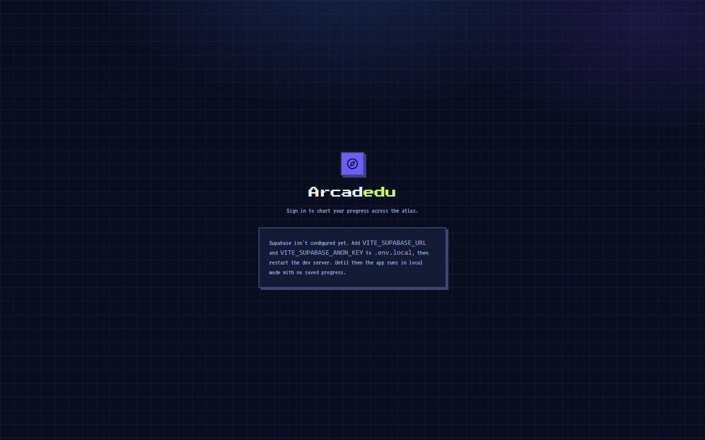<br><sub>Login: email magic link</sub></td>
</tr></table>

## The Challenge loop

<p align="center">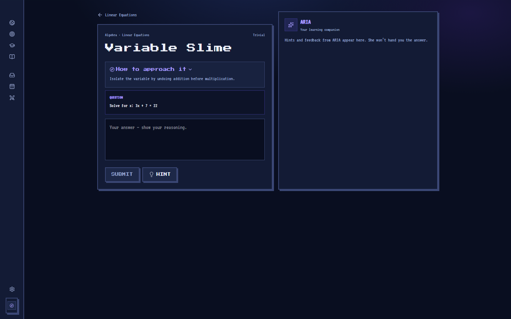</p>

```mermaid
sequenceDiagram
    participant S as Student
    participant UI as Challenge.tsx
    participant AI as /api/ai (Gemini)
    participant Eng as engine.ts

    UI->>AI: generate_enemy_question(subject, topic, tier)
    AI-->>UI: { guidance, question, expectedConcept }
    Note over UI: QuestionCard renders guidance and question<br/>separately; only "question" is ever graded
    S->>UI: types an answer
    UI->>AI: grade_battle_answer(question, answer)
    AI-->>UI: { correct, quality, feedback }
    UI->>Eng: xpReward(tier, graded)
    Eng-->>UI: xp
    UI->>UI: addXp + completeNode (Zustand, then Supabase)
```

A boss node (the last one in a topic) runs the same loop once, just harder.
`generate_boss_challenge` asks for a demanding, multi-step question instead of
a 3-phase fight. **Story Mode is the one place that keeps narrative flavour**
(`generate_story_question`, its own narrator persona, unchanged); everywhere
else, the AI's lead-in is a plain "how to approach it" pointer, not a story.
There's no enemy artwork or fighting anywhere in the game, at any level. The
puzzle is the whole thing, in Story Mode too:

<p align="center">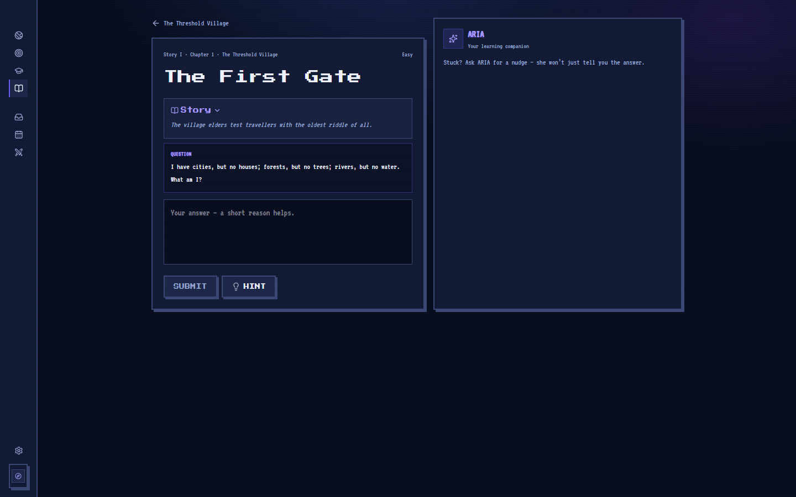</p>

**The deterministic engine** ([engine.ts](src/game/engine.ts)) is pure
functions. The AI decides `correct`/`quality` only; the engine owns every
number the player sees: `xpForLevel`/`levelForXp`/`levelProgress` (a gentle
quadratic XP curve), `xpReward(tier, graded)`, `skillRank(clears)`. The model
never sees or sets an XP number. The same split is the backbone of the Study
Agent in Part II.

## How the AI is constrained: [`/api/ai`](api/ai.ts)

A single Vercel **Node** function (`maxDuration: 60`). It's the only place the
Gemini key lives, and the only AI channel for the whole game. There is **no
raw prompt field**; the browser sends a closed `action` + structured `context`:

```jsonc
{ "action": "<one of a closed enum>", "context": { subject, topic, level, problem?, studentAnswer?, question?, expectedConcept?, difficulty?, chapter? } }
```

- **Learn actions** (free-text prose, rendered as ARIA speech): `explain` ·
  `summarize` · `hint` · `understand` · `steps` · `check_answer` ·
  `explain_mistake` · `example` · `simplify` · `similar_problem`. Each maps to
  an explicit guardrail, e.g. `hint` → *"exactly ONE nudge, never the method
  in full"*; `similar_problem` → *"problem statement only, no solution"*.
- **Challenge actions** (structured JSON): `generate_enemy_question` ·
  `grade_battle_answer` · `generate_boss_challenge` · `grade_boss_answer` ·
  `generate_story_question`.

**Resilience**: transient failures (429/500/502/503/504/network) retry with
backoff, then fail over to `GEMINI_FALLBACK_MODEL`. The client
([lib/ai.ts](src/lib/ai.ts)) retries once more before showing *"the AI is busy,
try again."* A legacy Supabase Edge Function copy lives at
[supabase/functions/ai/index.ts](supabase/functions/ai/index.ts); keep both in
sync if you change a prompt, though the deployed app only calls `/api/ai`.

---

# Part II: The Autonomous Study Agent

A student creates a **Study Mission**: subject, Atlas topics, exam date,
weekly cadence. A short diagnostic seeds a per-topic **mastery** model. A
deterministic generator lays out a **study plan**. As the student completes
sessions (or misses them, or the exam gets closer) the agent re-evaluates and
quietly adjusts the plan.

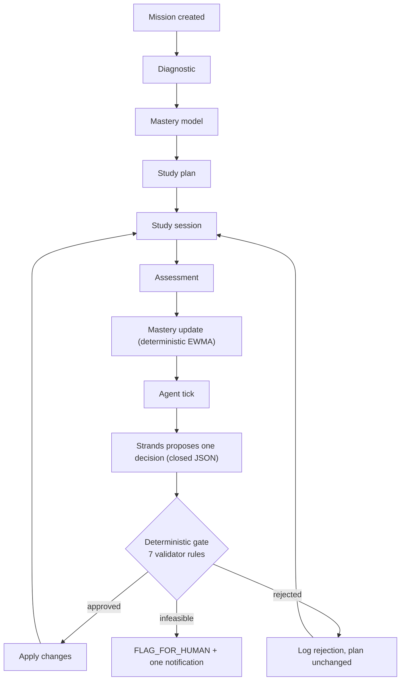

## Concepts and the math behind them

All tunables live in one file, [src/study/config.ts](src/study/config.ts).
They're explicitly MVP calibration, not permanent.

**Mastery** ([mastery.ts](src/study/mastery.ts)) is a deterministic rolling
EWMA, α = 0.4. The LLM never computes or writes it; `applySession` does:

```
q_obs      = correct ? quality : quality * 0.4      // a wrong answer still carries partial signal
mastery_n  = clamp01( mastery_(n-1) + 0.4 * (q_obs - mastery_(n-1)) )
```

**Flat-session detection**: two consecutive flat sessions is the evidence the
gate requires before the agent may escalate scaffolding.

```
delta = mastery_after - mastery_before
flat  = delta < 0.03  AND  mastery_after < 0.75(target)
```

**Plan confidence** ([confidence.ts](src/study/confidence.ts)) is the number
the agent exists to protect:

```
required_sessions  = Σ over topics  ceil( max(0, target - mastery) / 0.08 )
available_sessions = floor( days_remaining / 7 * sessions_per_week )
ratio              = available_sessions / max(required_sessions, 1)

ratio >= 1.15 → ON_TRACK   |   ratio >= 0.90 → AT_RISK   |   else → OFF_TRACK
override: days_remaining <= 2 AND any topic mastery < 0.50 → OFF_TRACK
```

**Strategy ladder** ([strategy.ts](src/study/strategy.ts)) allows one rung per
tick only (`NORMAL ↔ STRUGGLING ↔ PERSISTENT`):

| Level | Item difficulty | Scaffolding shown first |
| --- | --- | --- |
| `NORMAL` | base tier | none |
| `STRUGGLING` | one tier lower | `example`, `hint` |
| `PERSISTENT` | one tier lower | `steps` + `hint`, adds a `prerequisite_review` session |

**Plan generator** ([plan.ts](src/study/plan.ts)): one slot per topic first
(weakest first), then each remaining slot to the topic with the greatest need
(`target - mastery`, decremented 0.08/assignment); the final 3 days before the
exam become `revision` sessions.

## Three-layer separation of powers

Implemented literally as hard boundaries, a deliberate deviation from spec
§17's "agent calls mutating tools" (see [docs/study-agent.md](docs/study-agent.md)):

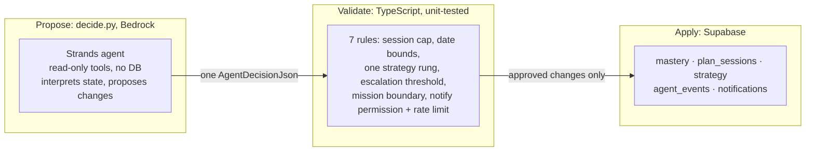

`api/agent/decide.py` runs the real **Strands Agents SDK** against **Amazon
Bedrock** with 6 read-only tools (`get_student_model`, `get_topic_mastery`,
`get_current_plan`, `get_recent_sessions`, `analyze_weakness`,
`get_calendar`) and returns one `AgentDecision` via
`agent.structured_output(...)`. It has no Supabase client and cannot apply
anything: [contract.ts](src/study/agent/contract.ts)'s `parseDecision`
rejects anything off-contract, and [validator.ts](src/study/agent/validator.ts)
re-checks the 7 rules before [apply.ts](src/study/agent/apply.ts) writes
anything. Example: the model asks to escalate `forces` to `STRUGGLING` and
insert a `prerequisite_review` session. The gate confirms `forces` is a
mission topic, `STRUGGLING` is one rung from `NORMAL`, it has 2+ flat sessions,
and the target week has room, then applies both. Ask for `PERSISTENT` in one
jump, or name a topic outside the mission, and the **whole** decision gets
rejected and logged; there's never a partial apply.

**Decisions (9):** `KEEP` · `REPRIORITIZE` · `REDISTRIBUTE` ·
`ADVANCE_DIFFICULTY` · `ESCALATE_STRATEGY` · `DE_ESCALATE_STRATEGY` ·
`INSERT_REMEDIATION` · `REPLAN` · `FLAG_FOR_HUMAN`.
**Change ops (6):** `set_strategy` · `set_priority` · `insert_session` ·
`drop_session` · `move_session` · `replan`.

## The tick pipeline

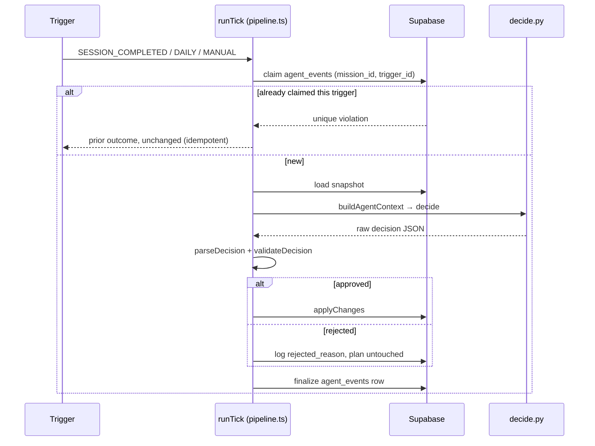

Three triggers: `SESSION_COMPLETED` (right after a mission session),
`DAILY` (Vercel Cron `0 6 * * *` → every active mission, service-role client,
the only RLS bypass), `MANUAL` ("Re-plan now", 3-minute idempotency bucket).
**Idempotency**: `agent_events` has `UNIQUE(mission_id, trigger_id)`, so the
same session completion, the same day's tick, or a double click each apply *at
most once*. **Failure safety**: every failure mode (Strands unreachable, bad
decision JSON, validator rejection, a Supabase write failing mid-apply) leaves
the plan unchanged and logs why. There's never a partial apply, never a false
success.

## Data model

| Migration | Tables | Notes |
| --- | --- | --- |
| [0001_init_progress.sql](supabase/migrations/0001_init_progress.sql) | `profiles`, `subject_progress`, `topic_progress` | Game progress. New-user trigger seeds a profile row. |
| [0002_study_missions.sql](supabase/migrations/0002_study_missions.sql) | `study_missions`, `mission_topics`, `topic_mastery`, `plan_sessions`, `session_log`, `agent_events`, `notifications` | The Study Agent. `agent_events` has `UNIQUE(mission_id, trigger_id)`, the idempotency key. |
| [0003_calendar_routines.sql](supabase/migrations/0003_calendar_routines.sql) | `calendar_events`, `routines`, `routine_occurrences` | Fixed dates + recurring commitments. `routine_occurrences` is `UNIQUE(routine_id, due_date)`, materialised lazily. |
| [0004_mission_artifacts.sql](supabase/migrations/0004_mission_artifacts.sql) | `mission_artifacts` | Things the agent produces: prepped sessions, revision sheets, reports, drafts. |
| [0005_onboarding.sql](supabase/migrations/0005_onboarding.sql) | none | `profiles.onboarded_at`, for the first-run wizard. |
| [0006_routine_cadence.sql](supabase/migrations/0006_routine_cadence.sql) | none | Widens `routines.cadence` to `daily`\|`weekly`\|`biweekly`\|`monthly`. |
| [0007_calendar_time.sql](supabase/migrations/0007_calendar_time.sql) | none | Adds `calendar_events.event_time` / `routines.time_of_day` (`"HH:MM"` text, regex-checked); a date alone was never enough. |

**RLS**, every table: `study_missions`/`notifications`/calendar tables scope
directly (`auth.uid() = user_id`); the five mission-child tables scope through
mission ownership (`exists (select 1 from study_missions where id = mission_id
and user_id = auth.uid())`). Only `api/agent/daily.ts` bypasses RLS, with the
service role key, gated by `CRON_SECRET`.

## Academic Calendar, Inbox and routines

*"An agent that handles routine work in the background and only surfaces when
there's a real decision"*, made concrete in three pieces:

- **[Calendar](src/screens/Calendar.tsx)** (`/calendar`): a month grid of
  dates + study sessions, click a day for its agenda + quick-add (now with a
  time, not just a date), and recurring routines (also with a time). Feeds the
  agent: `deadlineCrossings` flags a 14/7/3/1-day milestone; `routines_behind`
  is a weakness signal.
- **[Inbox](src/screens/Inbox.tsx)** (`/inbox`): a digest line (the latest
  `DAILY` run), **Needs you** (unread `notifications`, meaning the agent
  couldn't decide alone), and **On your plate**
  (`buildReminders({sessions, events, routineOccurrences})`, computed live,
  grouped Overdue/Today/This week). A recurring routine does **not** flood this
  list with every future date; only today's/overdue occurrence becomes an
  item, and each active routine gets one static line instead (e.g. *"Every
  Tuesday at 6:00 PM"*).
- **Routine materialisation**: `ensureRoutineOccurrences` (Inbox load) and
  `materialiseRoutines` (daily tick) both roll `routine_occurrences` 21 days
  ahead and flip overdue `pending` rows to `missed`, so "done"/"missed" always
  has somewhere to live.

## Study Agent screens

| Route | Screen | What it does |
| --- | --- | --- |
| `/inbox` | [Inbox](src/screens/Inbox.tsx) | Digest + decisions + computed reminders. The one place the agent surfaces. |
| `/calendar` | [Calendar](src/screens/Calendar.tsx) | Dates + sessions + routines, each with a time. |
| `/missions`, `/missions/new` | [MissionsHome](src/screens/MissionsHome.tsx), [MissionCreate](src/screens/MissionCreate.tsx) | List / create a mission: subject → topics → exam date → cadence → diagnostic. |
| `/missions/:id/diagnostic` | [MissionDiagnostic](src/screens/MissionDiagnostic.tsx) | 2 AI questions/topic → `seedDiagnosticAndPlan`. |
| `/missions/:id` | [StudyPlan](src/screens/StudyPlan.tsx) | Confidence badge, per-topic mastery, timeline, "Re-plan now", activity feed. |
| `/missions/:id/s/:planSessionId` | [MissionSession](src/screens/MissionSession.tsx) | 4 practice items → `recordMissionSession` → fires `SESSION_COMPLETED`. |

It doesn't fork the question-answering system: missions reuse
`generateEnemyQuestion`/`gradeBattleAnswer`, `QuestionCard`, `AriaSpeech`, and
the Atlas lookups. The same closed-action registry is the boundary here too.

## The agent does the work, not you

| Was your work | Now the agent's | How |
| --- | --- | --- |
| Fill a form, hand-type every exam date | **Syllabus intake** | Paste a syllabus → `map_syllabus` maps it onto Atlas topics + `calendar_events`. |
| Wait for each item to generate | **Session prep** | Next session's items generated ahead of time, cached as an artifact. |
| Write your own revision notes | **Revision sheets** | One-page KEY IDEAS/FORMULAS/MISTAKES sheet per topic, on request or by the agent (max 2/tick). |
| Draft an update or an extension email | **Draft-and-approve** | Drafted from facts only, never a fabricated reason. Lands as a draft with **Copy**/**Looks good**. Nothing sends itself. |
| Track what changed | **Weekly brief** | "What the agent did lately," composed from the last 7 days of applied changes. |

All of this lands in `mission_artifacts` through the same deterministic gate.
None of it touches the student's coursework.

---

# How AI is used, end to end

| Surface | Model | Used for | Writes to the DB? |
| --- | --- | --- | --- |
| [`/api/ai`](api/ai.ts) | Gemini (+ fallback model) | Generating/grading every challenge, Study Hall help, and producer actions (`map_syllabus`, `write_revision_sheet`, `write_progress_report`, `draft_message`): extract/assemble/phrase, never solve. | **No.** Returns text/JSON to the caller. |
| [`/api/agent/decide.py`](api/agent/decide.py) | Bedrock (Claude) via Strands | Proposes plan changes as one closed-contract JSON. | **No.** Read-only tools; the gate does the writing. |

Hard boundaries: no free-text prompt channel from the browser; no `solve_this`
op (the agent's ops are schedule + admin only); no model writes XP, mastery, or
a schedule directly (`engine.ts` and `src/study/` own every number, the gate
owns every mutation); keys stay server-side (`GEMINI_API_KEY`, `AWS_*`, never
`VITE_`-prefixed).

# How Supabase is used, end to end

**Auth**: email magic-link ([src/auth/](src/auth/)). No env vars means **local
mode**: no sign-in, in-memory game progress, Study Missions disabled with a
notice (this is how the screenshots in this README were taken).

**Three access patterns:**

| Caller | Client | Scope |
| --- | --- | --- |
| Browser | anon key + user session | RLS: the user's own rows only. |
| [tick.ts](api/agent/tick.ts) | anon key + forwarded user JWT | RLS: that user's mission only. |
| [daily.ts](api/agent/daily.ts) | **service role key** | Every active mission. The only RLS bypass, gated by `CRON_SECRET`. |

Game progress writes are fire-and-forget optimistic upserts
([lib/progress.ts](src/lib/progress.ts)); mission/agent writes go through the
deterministic engine and the gate, never directly from a screen.

---

# Repository layout

```
api/
  ai.ts                     closed-action Gemini function (game + all question gen/grading)
  agent/
    decide.py               Strands agent on Bedrock, proposes a decision, no DB
    tick.ts / daily.ts       single-mission (JWT/RLS) and DAILY (cron, service role) ticks

src/
  game/        atlas.ts (content model)  engine.ts (deterministic XP/skill rank)  story.ts
  lib/         ai.ts (client for /api/ai)  supabase.ts  progress.ts  types.ts  image.ts (avatar resize)
  study/       config.ts types.ts dates.ts mastery.ts confidence.ts plan.ts strategy.ts calendar.ts   (unit-tested engine)
               db.ts (Supabase IO)  agent.ts (runAgentTick)  useInboxCount.ts  MonthCalendar.tsx
    agent/     contract.ts context.ts validator.ts schedule.ts apply.ts pipeline.ts   (+ *.test.ts)
  screens/     Atlas Country LevelPath Challenge          the game
               StoryHome StoryChapter StoryChallenge      Story mode
               LearnMode Quests Profile Settings Login
               MissionsHome MissionCreate MissionDiagnostic StudyPlan MissionSession
               Inbox Calendar
  auth/  components/  theme/  store.ts  App.tsx

supabase/migrations/   0001 through 0007  (see Data model above)
docs/study-agent.md    architecture + AWS/AgentCore/EventBridge mapping
vercel.json            the daily cron
```

---

# Setup

**1. Frontend**
```bash
npm install
cp .env.local.example .env.local     # fill in as needed
npm run dev
```

**2. Serverless functions locally**: `/api/ai`, `/api/agent/tick`,
`/api/agent/daily` are Vercel functions.
```bash
npm i -g vercel && vercel dev
```
`/api/agent/decide` (Python) additionally needs Bedrock credentials. Without
it, `/api/agent/tick` returns a recoverable `503` and the plan is left
unchanged. The rest of the app is unaffected.

**3. Supabase**
1. Run the migrations in order (Dashboard → SQL editor, or `supabase db push`).
2. **Authentication → Providers**: enable Email (magic link).
3. **Authentication → URL Configuration**: add `http://localhost:5173/**` and
   your deployed origin to Redirect URLs.
4. Set `VITE_SUPABASE_URL` and `VITE_SUPABASE_ANON_KEY`.

Without Supabase env vars the app runs in **local mode**: no sign-in,
in-memory progress, Study Missions disabled.

**4. Deploy**: push to Vercel, set the env vars below in Project Settings.
`vercel.json` registers the daily cron.

> **Rotate the Gemini key** before any public deploy.

---

# Environment variables

| Var | Scope | Required | Purpose |
| --- | --- | --- | --- |
| `VITE_AI_ENDPOINT` | client | yes | Where `/api/ai` lives. Default `/api/ai`. |
| `GEMINI_API_KEY` | server | yes | Read by `api/ai.ts` only. |
| `GEMINI_MODEL` / `GEMINI_FALLBACK_MODEL` | server | no | Defaults `gemini-3.6-flash` / `gemini-2.5-flash`. |
| `VITE_SUPABASE_URL` / `VITE_SUPABASE_ANON_KEY` | client + functions | for auth/missions | Supabase project URL + anon key. |
| `VITE_AGENT_ENDPOINT` | client | no | Where `runAgentTick` posts. Default `/api/agent/tick`. |
| `SUPABASE_SERVICE_ROLE_KEY` | server | for the daily tick | RLS bypass for `daily.ts`. |
| `CRON_SECRET` | server | for the daily tick | Gates `daily.ts`; Vercel Cron sends it. |
| `AWS_ACCESS_KEY_ID` / `AWS_SECRET_ACCESS_KEY` / `AWS_REGION` | server (Python) | for the agent | Bedrock credentials for `decide.py`. |
| `BEDROCK_MODEL_ID` | server (Python) | no | Must be enabled in your Bedrock account. |

---

# Testing

```bash
npm test           # node --test, run once
npm run test:watch
```

Runs on **Node's built-in test runner** with native TS stripping, no Vitest
(Rollup's native binary doesn't install cleanly in every Windows environment).
**90 tests**, all deterministic logic. Nothing here needs a model or a DB:

| File | Covers |
| --- | --- |
| `mastery.test.ts` | EWMA step, `applySession`, flat detection, diagnostic seed. |
| `confidence.test.ts` | ON_TRACK/AT_RISK/OFF_TRACK bands, the 2-day override. |
| `plan.test.ts` | Weekly cap, date bounds, weakest-topic weighting, revision window. |
| `strategy.test.ts` | One-rung transitions, two-rung rejection, scaffold ladder. |
| `agent/contract.test.ts` | `parseDecision` accepts/rejects malformed decisions. |
| `agent/validator.test.ts` | Each of the 7 gate rules. |
| `calendar.test.ts` | `routineOccurrenceDates`, `buildReminders` (incl. dropping future routine occurrences), `formatTime`/`routineScheduleLabel`, `deadlineCrossings`, `routinesBehind`. |

The Python agent and the Supabase-touching pipeline aren't unit-tested here (no
Bedrock creds/DB in this environment); `runTick` takes an injectable `decide`
fn for that. Pre-existing lint errors in
[icons.tsx](src/components/icons.tsx) are unrelated to this work.

---

# Look & feel

<p align="center">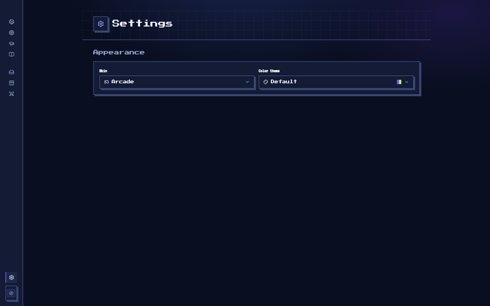</p>

Arcade-only, Codecademy-inspired: deep-navy ground, indigo primary (`--mana`),
chartreuse highlight (`--xp`), pink danger, mint success. Press Start 2P for
headings, VT323 for body; every corner squared, chunky 2px pixel frames with an
offset shadow. One theme axis, `data-theme` `light`\|`dark` (`system`
resolved live), plus a colour-theme picker; `data-skin` is always `arcade`.
All colour is CSS variables in [index.css](src/index.css). Shared primitives
(`Panel`, `Btn`, `Bar`, `PageHeader`, `Chip`, `Stat`, `EmptyState`) live in
[ui.tsx](src/components/ui.tsx). Avatars are a plain uploaded photo (resized
client-side to a 256×256 JPEG), not a preset icon set.

**Stack**: React 19 · Vite · TypeScript · React Router 7 · Tailwind v4 ·
Framer Motion · Zustand · Supabase (Auth + Postgres + RLS) · Vercel Functions
(Node + Python) · Gemini API · Strands Agents SDK · Amazon Bedrock · Vercel
Cron.

---

# Status and roadmap

| Area | State |
| --- | --- |
| Learning game (Atlas, Challenge, Story, Study Hall, engine) | ✅ Working |
| Closed-action AI (`/api/ai`, retry/failover) | ✅ Working |
| Auth + game progress (Supabase, RLS, local-mode fallback) | ✅ Working |
| Study Missions: create, diagnostic, deterministic engine, sessions | ✅ Working, unit-tested |
| Academic Calendar (dates + routines, both with a time), fed into the agent | ✅ Working |
| Inbox (digest + decisions + computed reminders, routine summary lines) + sidebar badge | ✅ Working |
| Strands agent (`decide.py`) + decision contract + gate | ✅ Built (needs Bedrock creds to run) |
| Triggers (`SESSION_COMPLETED`/`MANUAL`/`DAILY`) + idempotency | ✅ Wired |
| Bedrock **AgentCore** hosting, **EventBridge Scheduler** | 📄 Documented ([docs/study-agent.md](docs/study-agent.md)), not wired |
| `student_model.level` in the agent context | ⚠️ Hardcoded to `1` |
| Notification action buttons (`add_session`, `adjust_target`) | ⚠️ Stubs |
| Atlas Physics topics | ⚠️ Only Kinematics/Forces |
| Free-text syllabus (`syllabus_source = 'freetext'`) | 🔭 Schema ready, UI deferred |
| Email/SMS/push notifications | ❌ Out of scope (in-app only) |
