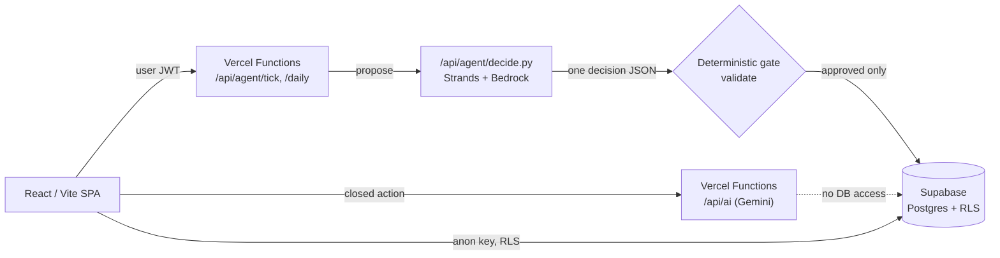
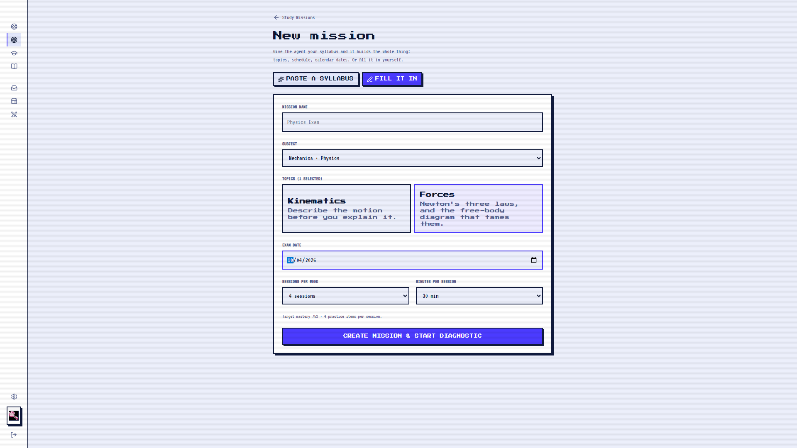
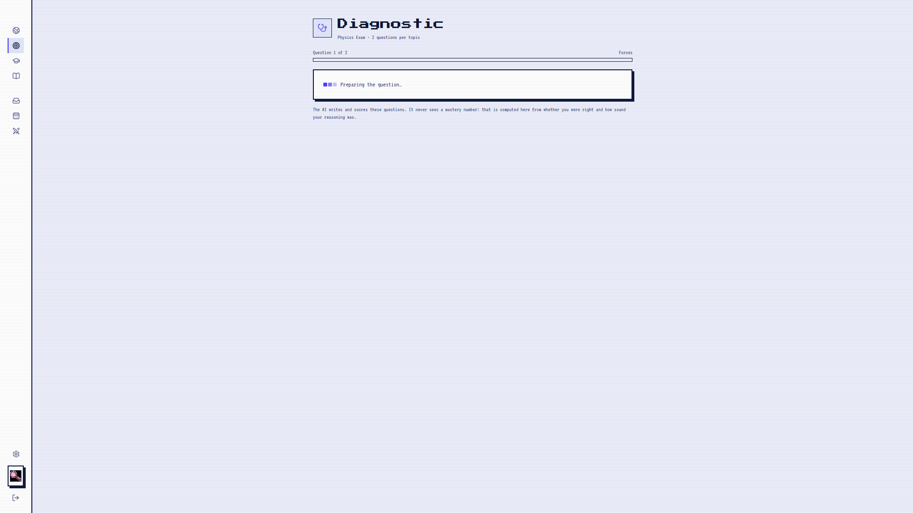
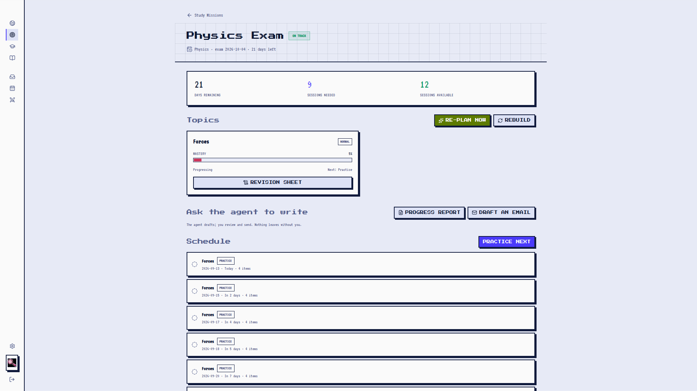
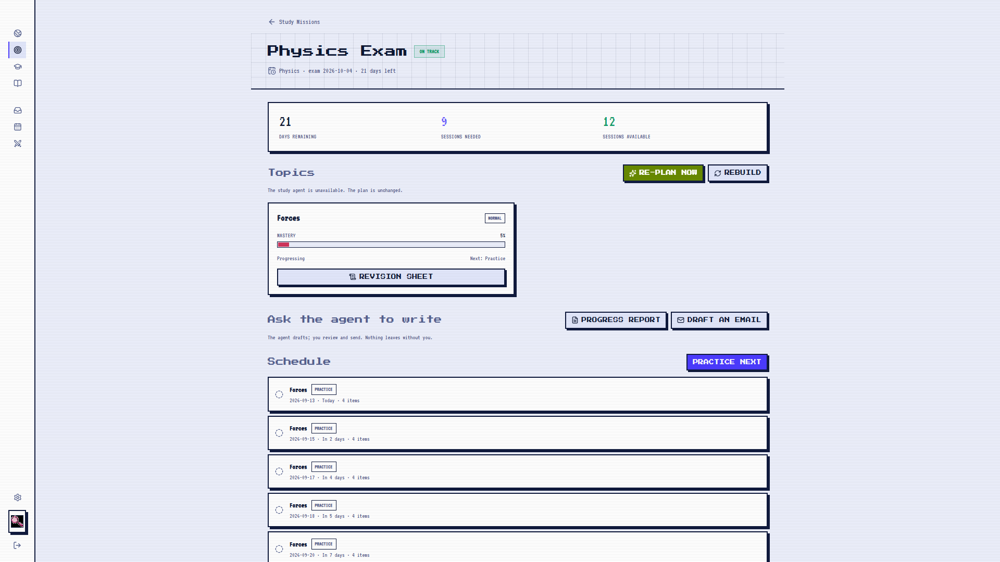
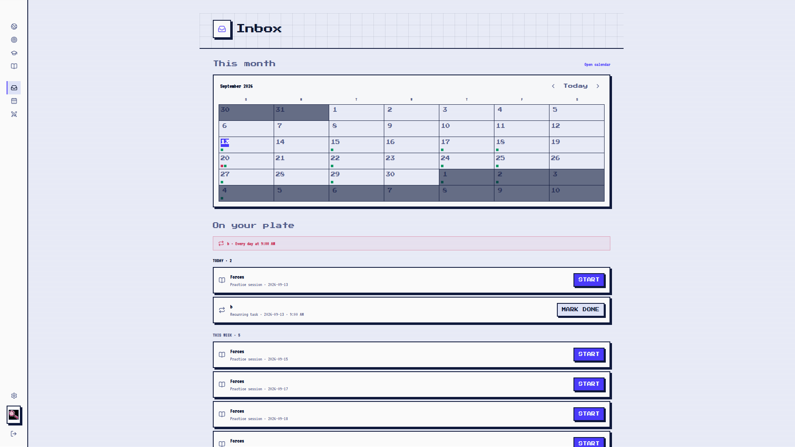
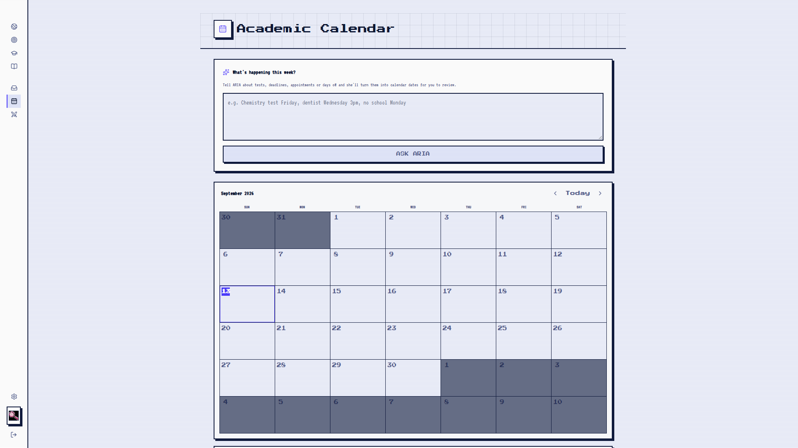

# Arcadedu

**An AI learning universe with an autonomous study agent on top of it.**

<p align="center"></p>

Two principles hold the whole system together:

> **The AI teaches. It never does the student's work.**

> **The agent manages the learning. The student does the learning.**

The student never gets a free-text prompt box, and the study agent never
writes an XP number, a mastery score, or a mutation directly. Every AI call is
a fixed, registered action; every write goes through deterministic code.

## Why it's different

- **AI-generated challenges** — no authored question bank. Every practice
  question, story puzzle and grade is generated and graded live from a
  `(subject, topic, difficulty)` triple.
- **Closed-action AI architecture** — the browser never sends a raw prompt.
  A server-side registry maps a fixed `action` enum to a guardrail, so the
  model can hint or explain but never hand over a solution.
- **Deterministic progression** — XP, level, and unlock logic are pure
  functions. The model decides `correct`/`quality`; the engine decides the
  number.
- **Study Missions** — a diagnostic seeds a per-topic mastery model, then a
  deterministic generator lays out a full study plan against an exam date.
- **Mastery tracking** — a rolling EWMA per topic, updated after every
  session. Never touched by the model.
- **Autonomous planning** — an agent re-evaluates the plan as sessions
  complete, get missed, or the exam gets closer.
- **Academic calendar** — fixed dates and recurring routines, both time-aware,
  feed deadline pressure and missed-routine signal straight into the agent.
- **Agent decision system** — a Strands agent on Amazon Bedrock reads a
  compact, read-only snapshot and returns exactly one structured decision.
- **Deterministic validation gate** — a hand-written rule set re-checks every
  proposed change before anything is applied. Off-contract decisions are
  rejected wholesale, never partially applied.
- **Human escalation** — when the plan can't reach its target, the agent
  flags a human decision instead of guessing.
- **Safety boundaries** — no `solve_this` op exists anywhere in the system,
  for either AI layer.

## Architecture



The Strands agent on Bedrock only *proposes* — it has no database client. The
TypeScript gate re-validates every proposed change against session caps, date
bounds, strategy rung limits and mission ownership before deterministic code
applies it. A rejected or off-contract decision leaves the plan untouched and
gets logged, never partially applied.

## Product

Navigation is a single expand-on-hover sidebar:

| Screen | What it does |
| --- | --- |
| **Atlas** | Pannable world map — each subject is a region, each topic a node path. |
| **Inbox** | The one place the agent surfaces: a daily digest, decisions needing a human call, and computed reminders (overdue / today / this week). |
| **Calendar** | A month grid of exam dates, assignments and recurring routines, each with a time. |
| **Missions** | Create a Study Mission (subject → topics → exam date → cadence), run the diagnostic, follow the plan. |
| **Learn** | Study Hall — closed-action help on a problem: hints, steps, explanations, never a solution. |
| **Story** | A 12-chapter narrative mode built from general-knowledge puzzles, unlocked in order. |
| **Quests** | In-progress topics as a running to-do list. |
| **Profile** | Name, avatar, level, per-subject progress. |

Progression is gated at exactly one layer: nodes *within* a topic run in
sequence. Worlds and topics themselves are never locked — a learner who wants
inequalities before linear equations goes straight there.

## AI architecture

There is no free-form AI prompt anywhere in the product. Every AI call is one
of a fixed, server-registered set of actions with its own guardrail baked in.

| Layer | Model | Role | Writes to the DB? |
| --- | --- | --- | --- |
| [`/api/ai`](api/ai.ts) | Gemini (+ fallback) | Generates and grades every challenge, powers Study Hall help, and does admin work for the student (syllabus mapping, revision sheets, draft messages) — never the learning itself. | **No.** Returns text/JSON only. |
| [`/api/agent/decide.py`](api/agent/decide.py) | Amazon Bedrock (Claude) via Strands Agents SDK | Reads a read-only mission snapshot and proposes one plan change as closed-contract JSON. | **No.** The deterministic gate owns every write. |

Deterministic code — not the model — owns XP, mastery, scheduling and every
database mutation. Server-only keys (`GEMINI_API_KEY`, `AWS_*`,
`SUPABASE_SERVICE_ROLE_KEY`) never carry a `VITE_` prefix, so they never ship
to the browser.

## Demo video

[docs/demo/arcadedu-demo.mp4](docs/demo/arcadedu-demo.mp4) — a real, ~80 second
screen recording of the running app: mission creation, a live Gemini-graded
diagnostic, the deterministic study plan, a manual agent tick (recorded
against this environment's real credentials, where Bedrock is not configured
— captured honestly as "the study agent is unavailable, the plan is
unchanged"), Inbox and Calendar, and the Atlas. Narrated (synthesized
voiceover) with burned-in captions; a matching `.srt` sits alongside it.

## Screenshots

<table><tr>
<td width="240"><br><sub>Atlas: signed-in dashboard</sub></td>
<td width="240"><br><sub>Challenge: AI-generated question, graded live</sub></td>
<td width="240"><br><sub>Story Mode: a general-knowledge puzzle</sub></td>
</tr><tr>
<td width="240"><br><sub>Study Mission: subject, topics, exam date, cadence</sub></td>
<td width="240"><br><sub>Diagnostic: live-generated, live-graded</sub></td>
<td width="240"><br><sub>Study Plan: deterministic schedule + mastery</sub></td>
</tr><tr>
<td width="240"><br><sub>Agent tick: unavailable → plan held, logged</sub></td>
<td width="240"><br><sub>Inbox: digest, plate, activity</sub></td>
<td width="240"><br><sub>Calendar: dates + routines, agent-assisted entry</sub></td>
</tr><tr>
<td width="240"><br><sub>Level path through a topic</sub></td>
<td width="240"><br><sub>Study Hall: closed-action help</sub></td>
<td width="240"><br><sub>Profile: subjects, level, photo</sub></td>
</tr></table>

All screenshots and the demo video above are real captures of the running
application (Gemini and Supabase both live), not mockups. A reference note
on one artifact from the brief that could not be captured — a private,
authenticated claude.ai page — is in
[docs/reference/claude-artifact.md](docs/reference/claude-artifact.md).

## Tech stack

React 19 · TypeScript · Vite · React Router · Tailwind · Framer Motion ·
Zustand · Supabase · Vercel Functions · Gemini · Strands Agents SDK ·
Amazon Bedrock · Vercel Cron

## Setup

```bash
npm install
cp .env.local.example .env.local   # fill in the values you need
npm run dev
```

`npm run dev` (plain `vite`) only serves the SPA — it doesn't run Vercel
Functions. A dev-only Vite plugin in [vite.config.ts](vite.config.ts) shims
`/api/ai` and `/api/agent/tick` locally by loading the real handler modules
in-process, so `GEMINI_API_KEY` and Supabase-backed Study Missions work
end-to-end in local dev without the Vercel CLI. It's `apply: 'serve'` only —
production still runs on the actual Vercel Functions in `api/`, unmodified.
`/api/agent/decide` (the Python/Bedrock function) isn't shimmed — there's no
Python runtime in plain `vite dev` — so a local tick reports the agent as
unavailable, the same recoverable path it takes in production without
Bedrock credentials.

**Environment**: `.env.local` is gitignored and must never be committed.
`.env.local.example` documents every variable and which layer reads it —
client (`VITE_`-prefixed, safe in the browser), server-only (Node functions),
or Python (Bedrock/Strands). See also `supabase/.env.local.example` for the
legacy Supabase Edge Function.

**Supabase**:
1. Create a project, then run `supabase/migrations/0001` through `0007` in
   order (Dashboard → SQL editor, or `supabase db push`).
2. Authentication → Providers: enable Email (magic link).
3. Authentication → URL Configuration: add your local and deployed origins to
   Redirect URLs.
4. Set `VITE_SUPABASE_URL` / `VITE_SUPABASE_ANON_KEY`.

Without Supabase env vars the app runs in **local mode**: no sign-in,
in-memory progress, Study Missions disabled.

**The autonomous agent** additionally needs Bedrock credentials
(`AWS_ACCESS_KEY_ID`, `AWS_SECRET_ACCESS_KEY`, `AWS_REGION`) for
`api/agent/decide.py`. Without them, a tick returns a recoverable `503` and
the plan is simply left unchanged — nothing else in the app is affected.

## Deployment

1. Create a Supabase project and run the migrations in order.
2. Configure Supabase Authentication (Email provider + redirect URLs).
3. Set every variable from `.env.local.example` in Vercel → Project Settings
   → Environment Variables — never commit them.
4. Deploy this repository to Vercel.
5. Confirm `vercel.json`'s daily cron (`/api/agent/daily`, `0 6 * * *`) is
   registered and firing.
6. Verify Gemini: run a Challenge and confirm a question generates and grades.
7. Verify Bedrock/Strands: trigger a manual re-plan and confirm `decide.py`
   returns a decision instead of a `503`.
8. Create a Study Mission end to end and confirm the agent ticks and the
   Inbox reflects it.
9. Confirm no secrets are exposed to the browser (check the network tab for
   any request carrying a server-only key) before sharing the deployment.

See [DEPLOYMENT.md](DEPLOYMENT.md) for the detailed walkthrough of each step,
including exact variable sources, a `curl` command to test the cron directly,
and how to tell a missing-credential failure from a real bug.

## Current status

**Working**
- The learning game (Atlas, Challenge loop, Story mode, Study Hall, engine)
- Closed-action AI (`/api/ai`, retry + failover)
- Auth + Supabase-backed progress, with a local-mode fallback
- Study Missions: creation, diagnostic, deterministic plan engine, sessions
- Academic Calendar (dates + routines, time-aware) feeding the agent
- Inbox (digest, decisions, computed reminders)
- Agent decision contract, deterministic validation, trigger idempotency

**Built but requires credentials**
- The Strands + Bedrock agent (`api/agent/decide.py`) — runs once
  `AWS_ACCESS_KEY_ID` / `AWS_SECRET_ACCESS_KEY` / `AWS_REGION` are set.

**Not yet wired**
- Bedrock AgentCore hosting and AWS EventBridge Scheduler — documented as the
  target topology in [docs/study-agent.md](docs/study-agent.md), not yet
  deployed there.

**Known limitations**
- `student_model.level` in the agent context is currently hardcoded to `1`.
- One notification action (`adjust_target`) has no handler yet; `add_session`
  works.
- Physics coverage is limited to Kinematics and Forces.
- Email/SMS/push notifications are out of scope — the Inbox is in-app only.

## Security

- All secrets live in environment variables, never in source.
- `.env.local` (and any `.env*` file besides the checked-in `*.example`
  templates) is gitignored and must never be committed.
- Server-side credentials (`GEMINI_API_KEY`, `SUPABASE_SERVICE_ROLE_KEY`,
  `AWS_*`, `CRON_SECRET`) are read only by server functions and never carry a
  `VITE_` prefix, so they can't reach the browser bundle.
- Supabase Row-Level Security scopes every table to `auth.uid()`, directly or
  through mission ownership; the service-role key is the one deliberate
  bypass, used only by the cron-gated daily tick.
- Neither AI layer can mutate the database directly. The Strands agent has
  read-only tools and no DB client; the deterministic gate is the only path
  to a write, and it rejects anything off-contract wholesale.

## License

MIT — see [LICENSE](LICENSE).
